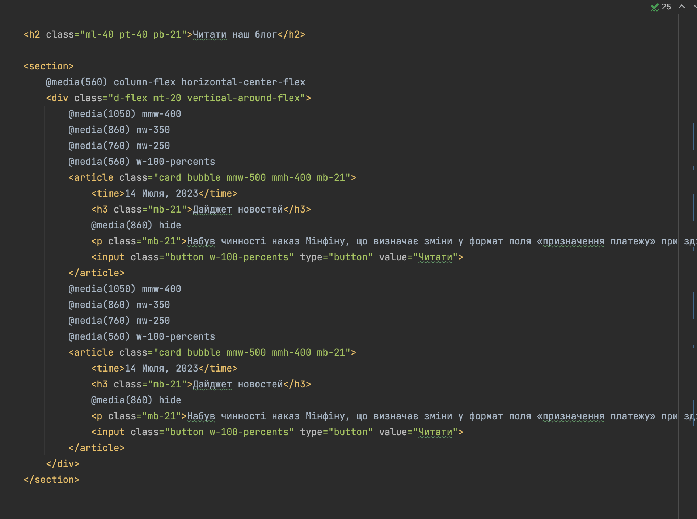

# NEO UI Kit
A new word in adaptive practices! Just look at this magic yourself!  
(Attention: install and use PHP 8.2 in your system for properly compiler work!)

# Benefits
 

### Modern design

### Beautiful adaptive without CSS

### PHP Compiler
Do you know PHP? If yes, you can easily tweak the templating engine to your needs  
by making a fork of the project, and even contributing to this official repository to improve the framework!

### Low entry threshold
You don't need to know complex modern frameworks at all to utilize  
the full power of this framework! You will only need to know HTML and our delightful templating engine!   
For businesses, this means massive savings on hiring new employees  
and supporting existing projects written on this marvelous framework.

### Ready-made classes and components
You don't need to write your own UI-kit now, because our wonderful framework provide this possibility built-in!  
You also don't need to know JS-language, - it's enough to use components built into the framework,  
such as slider for example. Wonderful, isn't it?

## CLI Commands
`gulp serve` - run develop mode.

# Framework concepts
 

## Architecture
All framework files is contained in `neo/` folder.  
Here you can find built framework in `dist/` folder, and source file in `src/` folder.  

## Margins, paddings...
`.ml-5` is equal to `margin-left: 5px;`  
`.pb-49` is equal to `padding-bottom: 49px;`  
You can set inline margins and paddings from **1** to **50**! Step - 1px.

## Adaptive? Of course!
`.mw-150` is equal to `min-width: 150px;`  
`.mh-1000` is equal to `min-height: 1000px;`  
You can set max-width and height up to **10** (equals **1000px**). Step - 50px.   

Other examples: 
`.mww-250` equals `max-width: 250px;`  
`.w-auto` equals `width: auto;`  
`.h-100-percents` equals `height: 100%;`  

## Maybe grid like Bootstrap?
Isn't! You can include it massive framework, but in Neo we use default CSS Grid System or Flexbox.  

### Flex
`.d-flex` is equal to `display: flex;`  
`.vertical-center-flex` equals `justify-content: center;`  
`.horizontal-center-flex` equals `align-items: center;`  

### Grid
`.d-grid` is equals `display: grid;`  

## And other good stuff!
`.card` - make element white and aa shadow to it.  
`.bubble` - make element zoomed-in-out on hover.  
